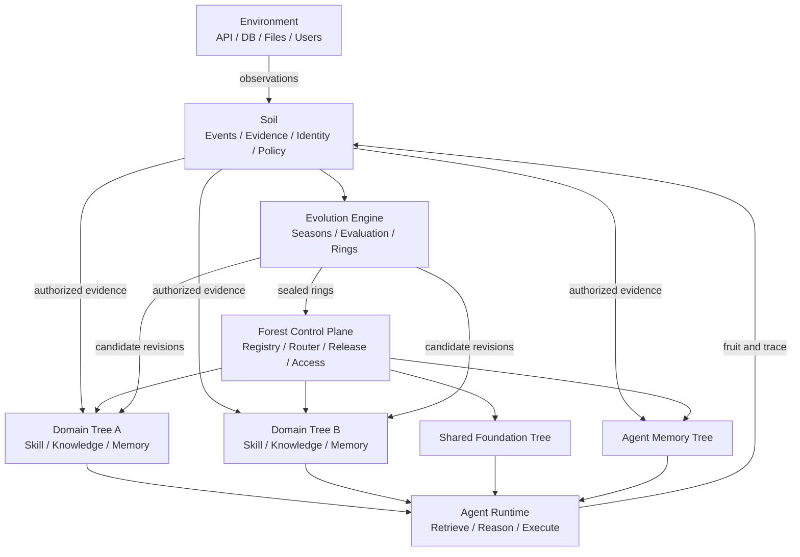
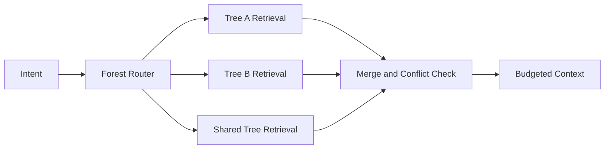
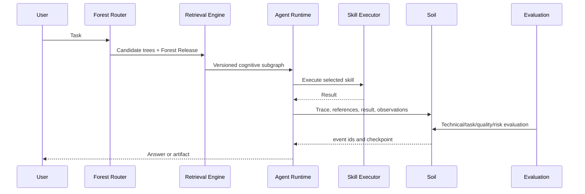

# Yggdrasil Agent 认知森林落地方案

## 1. 文档目标

Yggdrasil 是一套面向长期运行 Agent 的认知管理系统。它将可执行能力（Skill）、领域知识（Knowledge）和经验记忆（Memory）组织为可检索、可演化、可验证、可回滚的认知森林。

本方案将概念蓝图收敛为一套可实施架构，重点回答：

- 什么内容进入土壤、树和森林；
- Skill、Knowledge、Memory 如何统一又保持类型边界；
- 一次 Agent Run 如何检索、执行、反思和沉淀；
- 春夏秋冬如何成为可调度、可测试的演化流程；
- 年轮如何承载版本、发布、复现和回滚；
- 如何分阶段建设，避免一开始陷入复杂的全自动自学习系统。

## 2. 核心定义

### 2.1 总体定义

Yggdrasil 不是单棵无限增长的知识树，而是一套认知森林运行协议：

> 土壤保存共同现实，领域树形成认知，森林组织多树协作，四季驱动知识演化，年轮固化稳定版本。

底层应同时存在三种结构：

- **树形命名空间**：表达领域归属、所有权、权限继承和浏览结构；
- **认知图**：表达知识、能力、记忆之间的证据、依赖、触发和冲突；
- **版本时间线**：表达事件、节点修订、季节活动、年轮发布和回滚历史。

树是产品和治理视图，图是关系模型，时间线是可靠性基础。不能只用其中一种代替全部。

### 2.2 隐喻与工程对象映射

| 隐喻 | 工程对象 | 职责 |
|---|---|---|
| 土壤 Soil | 事件、观察、证据、身份、权限、时钟 | 保存可追溯的共同现实 |
| 森林 Forest | 树目录、路由、组合版本、跨树协议 | 发现、隔离、协作和统一治理 |
| 树 Tree | 一个限界上下文 | 独立组织某领域的技能、知识和记忆 |
| 根 Root | 领域化经验记忆 | 保存某棵树从事件中学到的经验 |
| 干 Trunk | Agent Run 决策轨迹 | 运行时形成，不作为静态知识节点 |
| 枝 Branch | Skill / Capacity | 对外部环境执行动作 |
| 叶 Leaf | Schema、Fact、State、Heuristic | 为技能和推理提供上下文 |
| 果 Fruit | 执行结果 | 作为事件重新进入土壤 |
| 四季 Season | 四类演化作业 | 摄入、验证、归纳、冻结 |
| 年轮 Ring | 不可变认知版本 | 发布、复现、比较、审计和回滚 |

### 2.3 树的边界

一棵树不等同于一个宽泛的自然语言 domain，而应对应一个 **限界上下文（bounded context）**。满足下列多数条件时才拆成独立树：

- 有明确的所有者或维护团队；
- 有独立权限边界；
- 有独立领域语言或本体；
- 知识更新频率显著不同；
- 有独立质量评估方法；
- 需要单独发布、快照或回滚；
- 大多数任务可以在树内完成；
- 污染或故障应被局部隔离。

建议初始森林包含三类树：

- **Domain Tree**：如 SQL、Security、Customer Support；
- **Shared Foundation Tree**：跨域策略、通用能力、组织级规则；
- **Agent/Team Memory Tree**：个体或团队经验、偏好和策略。

## 3. 设计原则

1. **事实与解释分离**：土壤记录发生了什么，树记录某领域如何理解它。
2. **统一外壳、类型化载荷**：所有认知原子共享身份、版本和治理协议，但 Skill、Knowledge、Memory 使用不同载荷和约束。
3. **反思只生成候选**：LLM 不得凭反思直接发布事实或核心规则。
4. **证据优先**：所有可影响决策的知识必须可追溯到来源、案例或验证结果。
5. **读写分离**：在线执行读取已发布年轮；新知识写入生长区，不能直接污染生产版本。
6. **版本不可变**：已封存年轮不原地修改；错误通过隔离、回滚和新年轮修复。
7. **局部自治**：每棵树独立生长、评估、发布和回滚，不要求全森林同步过季。
8. **受控共享**：跨树访问通过公开接口或土壤事件完成，不允许任意穿透私有节点。
9. **评价驱动强化**：执行成功不等于认知正确，权重变化必须基于可归因评价。
10. **先可控再自治**：MVP 先实现结构化检索、证据和版本，再逐步开放自动演化。

## 4. 总体架构



### 4.1 控制面与数据面

**控制面**负责：

- Forest、Tree、Ring 的注册和状态管理；
- 树接口、权限、策略和本体版本；
- 年轮发布、组合版本和回滚；
- 季节作业编排；
- 审批与治理操作。

**数据面**负责：

- 向量、关键词和图检索；
- 上下文组装；
- Skill 选择与执行；
- Run 轨迹和评价采集；
- 土壤事件写入；
- 在线读取 active ring。

### 4.2 建议服务边界

初期建议采用模块化单体，边界稳定后再拆服务：

| 模块 | 职责 |
|---|---|
| Soil Service | 接收事件、观察、声明、证据和评价，维护不可变日志 |
| Tree Registry | 管理树、领域、本体、公开接口、所有者和权限 |
| Cognitive Store | 管理节点、边、修订及年轮视图 |
| Retrieval Engine | 两级路由、混合召回、图扩展、重排和上下文预算 |
| Agent Runtime | 执行 Run、调用 Skill、记录引用和结果 |
| Evaluation Service | 技术成功、任务成功、质量、风险和归因评估 |
| Evolution Engine | 执行四季作业和候选知识晋升 |
| Ring Manager | 冻结、验证、发布、组合、隔离和回滚年轮 |
| Inspector | 去重、冲突、悬空边、陈旧状态和污染巡检 |

## 5. 土壤设计

### 5.1 土壤的职责

土壤不是一棵全局超级知识树，也不直接承担业务推理。它保存所有树可能共同依赖的基础事实材料：

- 全局身份：Agent、用户、资源、树、节点和来源 ID；
- 原始事件：任务、工具调用、反馈和环境变化；
- 观察与声明：系统观测值和外部主体的陈述；
- 证据：文档片段、API 响应、数据库记录和评估报告；
- 时间：发生时间、有效时间、摄入时间和版本；
- 权限：租户、主体、访问范围和保留策略；
- 公共本体：跨树必须一致的最小概念集合；
- 完整性：来源、哈希、签名、可信级别和污染状态。

### 5.2 土层

```text
bedrock  不可变事件、原始证据和审计日志
commons  公共身份、公共本体和验证后的共享事实
tenant   组织或租户范围的数据
domain   特定领域可见的证据
private  用户、Agent 或团队私有经历
```

树只能吸收访问策略允许的土层。共享同一土壤不代表共享全部数据。

### 5.3 事件类型

必须区分以下对象，避免把“有人声称”误写成事实：

| 类型 | 含义 | 示例 |
|---|---|---|
| Observation | 系统直接观察 | 连接延迟为 820 ms |
| Claim | 某来源的陈述 | 用户称服务已经恢复 |
| Evidence | 可验证材料 | 监控截图、API 响应 |
| Evaluation | 对结果或知识的评价 | 任务完成度 0.91 |
| Decision | Agent 作出的选择 | 选择执行只读诊断 |
| ActionResult | 工具执行结果 | 查询成功并返回 25 行 |

### 5.4 事件最小字段

```text
event_id
event_type
tenant_id
subject_id
source_type
source_ref
payload
observed_at
ingested_at
valid_from
valid_until
trust_level
integrity_hash
access_scope
contamination_status
correlation_id
causation_id
```

土壤采用追加写。更正通过新事件声明 `corrects` 或 `invalidates`，不覆盖原始记录。

## 6. 认知原子模型

### 6.1 统一外壳

所有节点共享 `CognitiveNode` 外壳：

```text
node_id
tree_id
domain_path
node_type
role
status
title
summary
current_revision_id
utility
confidence
freshness
risk
valid_from
valid_until
created_by
created_at
```

`role` 保留原设计：

- `capacity`：可执行能力；
- `schema`：结构、分类法、数据模型；
- `heuristic`：带适用条件的经验规则；
- `case`：具体历史情境；
- `fact`：可验证的客观声明；
- `state`：带有效期的世界状态。

### 6.2 类型化载荷

**SkillSpec**：

```text
executor_ref
input_schema
output_schema
preconditions
postconditions
permissions
risk_class
timeout_policy
retry_policy
runtime_version
```

**KnowledgeClaim**：

```text
claim
applicability
exceptions
evidence_refs
verification_method
source_authority
```

**MemoryEpisode**：

```text
run_id
situation
action
outcome
reflection
lessons
participant_scope
```

统一的是身份、检索、关系、修订和治理协议，而不是将不同类型塞进同一组宽泛字段。

### 6.3 质量维度

不使用单一 `strength` 或 `health` 控制所有行为，拆分为：

- `utility`：对任务的历史效用；
- `confidence`：当前可信程度；
- `freshness`：是否仍然有效；
- `usage`：使用频率和最近使用时间；
- `risk`：错误使用的潜在损失；
- `status`：生命周期和可见性。

节点生命周期：

```text
candidate -> active -> deprecated -> archived
                    \-> quarantined
```

### 6.4 修订模型

节点内容不原地覆盖。每次变化创建 `NodeRevision`：

```text
revision_id
node_id
parent_revision_id
payload
change_reason
evidence_refs
author_type
author_id
created_at
content_hash
```

边同样使用 `EdgeRevision`。年轮引用确定的节点和边修订集合。

## 7. 认知关系模型

### 7.1 关系类型

建议将原始关系扩展为：

| 关系 | 语义 |
|---|---|
| enables | 知识或状态使能 Skill |
| triggers | 状态或案例触发 Skill |
| evidences | 案例或证据支持声明 |
| supports | 节点提高另一节点可信度 |
| derived_from | 目标由源节点推导而来 |
| contradicts | 两个声明冲突 |
| supersedes | 新节点或修订替代旧内容 |
| used_by | 被执行路径使用，仅记录引用 |
| strengthens | 评价证明该关系在特定条件下有效 |
| weakens | 评价削弱该关系在特定条件下的有效性 |
| imports | 树通过接口导入公开知识 |
| delegates_to | 将子任务委托给另一树的能力 |

### 7.2 边字段

```text
edge_id
source_id
target_id
relation
weight
confidence
applicability
propagation_policy
evidence_refs
valid_from
valid_until
created_by
```

### 7.3 污染传播规则

污染不能简单沿所有强边扩散。根据关系定义传播策略：

- `derived_from`：源失效时目标必须重新验证；
- `supports/evidences`：源失效时降低目标置信度；
- `used_by`：不传播真实性，只标记受影响的历史 Run；
- `contradicts`：进入冲突解析，不直接判定任一方有害；
- `supersedes`：旧版本降级但保留审计；
- `enables/triggers`：根据风险等级暂停关联 Skill 或降低路由分数。

## 8. 森林与跨树协作

### 8.1 Tree Manifest

每棵树通过清单声明边界和能力：

```text
tree_id
name
bounded_context
owner
ontology_version
active_ring_id
capabilities
exported_nodes
exported_events
accepted_events
access_policy
retrieval_policy
evaluation_policy
season_policy
```

### 8.2 两种跨树方式

1. **同步嫁接**：通过 `imports`、`depends_on` 或 `delegates_to` 使用另一棵树公开的接口。
2. **异步落土**：一棵树发布标准化事件，其他树按权限订阅、解释并生成自己的认知。

优先使用事件实现松耦合。只有明确、稳定的运行时依赖才建立同步嫁接。

### 8.3 Forest Release

各树独立生成年轮，森林通过组合版本保证跨树运行可复现：

```text
ForestRelease 24
  sql-engineering: ring-18
  security: ring-7
  shared-foundation: ring-11
  agent-memory: ring-52
```

一次 Run 必须记录实际使用的 Forest Release、各 Tree Ring 和土壤检查点。

## 9. 子树检索与上下文组装

### 9.1 两级检索流程



第一阶段由森林路由选择通常不超过 1 至 3 棵候选树：

```text
route_score =
  intent_relevance
  * capability_match
  * access_factor
  * tree_health
  * freshness
  - execution_cost
```

第二阶段在每棵树内执行：

1. 按 active ring、权限、状态和有效时间过滤；
2. 关键词、向量和结构化字段混合召回；
3. 沿允许的关系进行受约束图扩展；
4. 使用 reranker 重排；
5. 检查冲突、风险和证据完整性；
6. 按角色配额组装上下文。

### 9.2 节点排序

```text
node_score =
  semantic_relevance
  * confidence
  * freshness
  * task_specific_utility
  * relation_relevance
  * access_factor
  - risk_penalty
  - redundancy_penalty
```

历史使用频率只能作为弱信号，防止高频节点形成自我强化闭环。

### 9.3 上下文预算

不同角色使用独立配额，避免大量案例挤掉关键 Skill 契约：

```text
候选 Skill        1-3 个
Schema / Fact     3-8 条
Heuristic         2-5 条
相关 Case         1-3 个
冲突或风险提示    至少保留 1 个槽位
来源与版本信息    必须包含
```

序列化结果应同时包含内容、关系、来源、适用范围、置信度和版本，而不是仅拼接文本片段。

## 10. Agent Run 完整流程



Run 记录至少包括：

```text
run_id
intent
forest_release_id
tree_ring_ids
soil_checkpoint
retrieved_node_revision_ids
retrieved_edge_revision_ids
prompt_context_hash
selected_skill_revision_id
tool_inputs_hash
tool_outputs_ref
decision_trace
result_ref
evaluation_ids
```

只有这样才能复现“当时为什么做出这个决定”。

## 11. 学习与知识晋升

### 11.1 禁止直接强化

Skill 返回成功只能证明技术执行完成，不能证明任务正确。评价至少拆成：

- `technical_success`：调用是否正常完成；
- `task_success`：目标是否达成；
- `result_quality`：输出质量；
- `safety`：是否产生风险或违规；
- `user_feedback`：显式或隐式反馈；
- `delayed_outcome`：后续是否被纠正或撤销；
- `attribution`：哪些节点和关系真正产生贡献。

权重更新由异步 Evaluation Service 执行，不由 Agent Runtime 直接修改。

### 11.2 知识晋升管道

```text
soil observation
  -> candidate case
  -> case cluster
  -> candidate heuristic/fact
  -> evidence validation
  -> evaluation and approval
  -> active node in new ring
```

晋升约束：

- `fact` 必须有来源、有效时间和验证方法；
- `state` 必须有刷新或失效策略；
- `heuristic` 必须有适用条件、证据案例和已知反例；
- `case` 保留情境，不因单次成功自动泛化；
- 高风险知识必须人工审批；
- LLM 生成内容默认处于 `candidate` 状态。

## 12. 四季演化引擎

四季不是固定日历，而是四类有进入条件、退出条件和产物的治理作业。每棵树独立运行。

### 12.1 春：摄入与探索

目标：从土壤吸收新事件，形成候选认知。

作业：

- 从上个 `soil_checkpoint` 消费事件；
- 创建 candidate case、state、fact、heuristic 或 capacity；
- 建立低置信度候选边；
- 在沙盒中允许低强度候选参与；
- 记录候选的来源和生成策略。

退出条件示例：达到事件批次、候选规模或探索预算上限。

### 12.2 夏：试用与强化

目标：通过真实任务、回放和沙盒测试积累评价。

作业：

- A/B 比较候选策略；
- 回放历史任务；
- 聚合在线执行反馈；
- 更新 utility、confidence 和 applicability；
- 发现潜在副作用和反例。

退出条件示例：候选达到最小样本量，或评估窗口结束。

### 12.3 秋：归纳与修剪

目标：去重、抽象、解决冲突并确定晋升集合。

作业：

- 相似 case 聚类和合并；
- 从案例簇生成候选 heuristic；
- 验证 fact；
- 识别 contradicts 和 supersedes；
- 清理悬空边和重复节点；
- 对高风险变更发起审批。

退出条件示例：冲突关闭、审批完成、候选集合稳定。

### 12.4 冬：衰减、冻结与发布

目标：形成可发布、可回滚的新年轮。

作业：

- 对低效用、低新鲜度内容衰减或归档；
- 保护高置信核心知识；
- 执行完整性检查和回归测试；
- 生成候选 Ring；
- 比较上一年轮质量；
- 通过门禁后 seal 并切换 active ring。

退出条件：发布成功、候选被拒绝，或回到秋季继续修订。

## 13. 年轮模型

### 13.1 年轮定义

年轮是一轮完整认知治理后的不可变版本。它不是数据全量复制，而是能够重建当时树状态的版本边界。

```text
ring_id
tree_id
sequence
parent_ring_ids
lifecycle_status
health_status
started_at
sealed_at
soil_checkpoint
ontology_version
policy_version
node_revision_manifest
edge_revision_manifest
evaluation_report
quality_metrics
content_hash
```

生命周期状态：

```text
growing -> evaluating -> sealed -> archived
```

健康状态：

```text
healthy -> degraded -> quarantined -> superseded
```

`sealed` 表示不可变，不表示永远正确。

### 13.2 发布门禁

新年轮至少满足：

- 核心任务回归指标不低于阈值；
- 高风险知识具有有效证据和审批；
- 无关键悬空边；
- 污染节点未进入 active 集合；
- 新 heuristic 可回溯到案例；
- 过期 state 已失效或刷新；
- 检索延迟和 token 成本未失控；
- 数据和权限策略检查通过；
- 年轮内容哈希生成成功。

### 13.3 分支、比较与回滚

沙盒候选可以从同一年轮分叉，但只有通过冬季门禁后才成为正式年轮：

```text
Ring 11
  |- candidate A -> rejected
  |- candidate B -> Ring 12
```

若 Ring 12 出现污染：

1. 标记 Ring 12 为 `quarantined`；
2. 将 active ring 回退至 Ring 11；
3. 基于 Ring 11 和修复证据创建 Ring 13；
4. 保留 Ring 12 的不可变记录用于审计。

## 14. 沙盒与免疫系统

### 14.1 沙盒分支

高风险或探索性变化必须在沙盒进行：

- 所有节点、边和权重修改写入 overlay；
- 使用生产年轮作为只读基线；
- Skill 写操作通过 mock、事务回滚或隔离环境执行；
- 对比基线和候选的任务质量、风险、成本；
- 通过后进入秋季候选，不直接合并 active ring。

### 14.2 污染检测

污染来源包括：

- 已撤销或恶意来源；
- Prompt Injection 进入记忆；
- 伪造证据；
- 过期状态被长期当作事实；
- 高错误率的自动归纳；
- 权限越界写入；
- 数据或模型评估发现系统性偏差。

检测后按影响图执行：定位来源、标记受影响修订、重新计算依赖节点置信度、暂停高风险能力、评估受影响 Run、决定局部降级或整轮回滚。

## 15. API 草案

### 15.1 土壤

```text
POST /v1/soil/events
GET  /v1/soil/events/{event_id}
GET  /v1/soil/streams/{stream}?after={checkpoint}
POST /v1/soil/evidence
POST /v1/soil/evaluations
```

### 15.2 树与认知原子

```text
POST /v1/trees
GET  /v1/trees/{tree_id}
POST /v1/trees/{tree_id}/nodes
POST /v1/nodes/{node_id}/revisions
POST /v1/trees/{tree_id}/edges
POST /v1/trees/{tree_id}/retrieve
```

### 15.3 四季与年轮

```text
POST /v1/trees/{tree_id}/seasons/spring/start
POST /v1/trees/{tree_id}/seasons/summer/evaluate
POST /v1/trees/{tree_id}/seasons/autumn/consolidate
POST /v1/trees/{tree_id}/rings/candidate
POST /v1/rings/{ring_id}/seal
POST /v1/rings/{ring_id}/activate
POST /v1/trees/{tree_id}/rollback
```

### 15.4 森林

```text
POST /v1/forest/route
POST /v1/forest/releases
GET  /v1/forest/releases/{release_id}
POST /v1/forest/releases/{release_id}/activate
```

所有写 API 应支持幂等键、主体身份、审计原因和权限校验。

## 16. 技术选型建议

### 16.1 MVP

优先选择成熟、简单且可审计的组件：

- **PostgreSQL**：节点、边、修订、年轮、权限和事务；
- **pgvector**：早期向量检索，避免过早引入独立向量数据库；
- **PostgreSQL FTS / OpenSearch**：关键词与过滤检索，规模上升后再拆；
- **对象存储**：大体积证据、执行产物和评估报告；
- **消息队列**：土壤事件流和异步评价，可从 Postgres Outbox 起步；
- **工作流引擎**：四季、审批和长任务，MVP 可用任务表，成熟期引入 Temporal；
- **OpenTelemetry**：Run、检索、Skill 与演化作业的全链路观测。

### 16.2 不建议 MVP 引入

- 独立图数据库；
- 自动本体演化；
- 全量事件溯源重放平台；
- 多模型自治投票系统；
- 完全自动知识发布；
- 跨区域多活。

当图扩展成为 PostgreSQL 的明确瓶颈后，再评估 Neo4j、NebulaGraph 或专用图计算层。

## 17. 安全、权限与合规

### 17.1 权限模型

采用 RBAC 与 ABAC 结合：

- RBAC 管理维护者、审核者、执行者和只读者；
- ABAC 根据 tenant、domain、data_classification、purpose 和 ring_status 决定访问；
- 权限同时作用于树、节点、证据、土层和 Skill 执行；
- 跨树接口默认拒绝，显式导出后才可访问。

### 17.2 记忆安全

- 用户输入不得直接成为系统规则；
- 外部内容保留来源边界，防止指令与数据混淆；
- 敏感字段在 embedding 前脱敏或使用隔离索引；
- 删除请求通过 tombstone、索引删除和派生关系重算完成；
- Skill 凭证不写入认知节点和 Run 明文；
- 高风险 Skill 必须进行参数验证、最小权限和人工确认。

### 17.3 审计

必须能够回答：

- 谁在何时创建、批准或废弃了某条知识；
- 它来自哪些证据；
- 哪些年轮包含它；
- 哪些 Run 使用过它；
- 污染发生后采取了什么回滚或修复动作。

## 18. 可观测性与评价体系

### 18.1 在线指标

- 森林路由准确率；
- Skill 选择准确率；
- 检索 precision、recall 和 nDCG；
- 上下文 token 数及有效引用率；
- 检索、推理和 Skill 调用延迟；
- 任务成功率和一次完成率；
- 错误知识引用率；
- 无效或过期状态命中率；
- 用户纠正率；
- 跨树调用成功率。

### 18.2 演化指标

- 候选到 active 的晋升率；
- active 到撤回或隔离的比例；
- case 聚类压缩率；
- heuristic 的证据覆盖度；
- 年轮相对上一轮的质量增益；
- 回滚次数与平均恢复时间；
- 污染发现时间和影响范围；
- 单位任务的治理成本。

### 18.3 核心目标

不能用节点数量衡量成长。建议定义净认知收益：

```text
Net Cognitive Gain =
  任务质量增益
  - 检索与推理成本
  - 治理成本
  - 错误知识造成的损失
```

至少保留三组对照：无认知系统、普通 RAG、Yggdrasil 图检索。

## 19. 分阶段落地路线

### Phase 0：基线与领域选择（2 周）

目标：选择一个真实、可评估、风险可控的首个领域。

交付：

- 100 至 300 个代表性任务集；
- 普通 RAG 和无 RAG 基线；
- 首棵树的限界上下文、Owner 和本体；
- 任务成功、检索质量、成本和安全指标；
- 数据分级与权限约束。

退出标准：能够稳定复现基线结果，并明确首期业务收益。

### Phase 1：种子系统（4 至 6 周）

目标：让 Agent 首次基于结构化、版本化认知上下文运行。

范围：

- Soil 追加事件和证据；
- CognitiveNode、Edge、Revision 基础模型；
- 一棵 Domain Tree 与一棵 Shared Tree；
- 关键词 + 向量 + 一跳关系扩展；
- Run 引用记录和结构化上下文；
- candidate/active 生命周期；
- 人工批准知识晋升；
- Ring 1 的冻结、发布和回滚。

退出标准：相对普通 RAG 在任务成功率或准确率上有显著提升，且每次输出可追踪到知识版本和证据。

### Phase 2：生长系统（6 至 8 周）

目标：从 Run 中稳定积累候选经验，并通过评价形成 Ring 2 及后续年轮。

范围：

- Evaluation Service；
- case 自动挂载；
- 春、夏作业；
- 沙盒 overlay 和历史任务回放；
- utility、confidence、freshness 分离；
- 两级森林路由；
- Agent Memory Tree；
- Forest Release。

退出标准：候选知识能够通过可解释评价进入新年轮，且回放结果优于上一年轮。

### Phase 3：治理与免疫（8 至 12 周）

目标：建立规模化维护、污染控制和稳定发布能力。

范围：

- 秋、冬作业；
- 去重、聚类、冲突和陈旧状态处理；
- 关系类型化污染传播；
- 年轮发布门禁；
- 自动隔离和局部回滚；
- 审批工作流和完整审计；
- 多棵领域树协作。

退出标准：可在演练中发现污染、定位影响、回退年轮并恢复服务，且全过程可审计。

### Phase 4：森林生态（持续）

目标：支持多 Agent、多团队和多租户的认知资产协作。

范围：

- 树接口和能力市场；
- 跨租户隔离与授权共享；
- 多 Agent 写入仲裁；
- 认知资产版本分发；
- 更精细的树路由和跨树任务编排；
- 可对话的知识维护与解释界面。

## 20. MVP 任务拆分

### Epic A：基础数据与土壤

- 建立事件、证据、节点、边和修订表；
- 实现事件幂等写入和 checkpoint；
- 接入对象存储；
- 实现来源、权限和有效时间字段；
- 建立审计日志。

### Epic B：树与检索

- 实现 Tree Manifest；
- 建立首棵领域树；
- 实现混合检索；
- 实现一跳受约束图扩展；
- 实现角色配额和上下文序列化；
- 记录节点引用与版本。

### Epic C：Agent Runtime

- 接入现有 Agent 主循环；
- 注册 3 至 5 个核心 Skill；
- 记录决策、参数、结果和错误；
- 写入 ActionResult 与 Observation；
- 支持基于固定 Ring 重放。

### Epic D：知识治理

- 实现 candidate 到 active 的人工审批；
- 实现 fact/state/heuristic 校验规则；
- 实现 supersedes 和 contradicts；
- 实现过期策略；
- 建立污染标记和检索排除。

### Epic E：年轮

- 生成修订 manifest；
- 创建候选 Ring；
- 执行完整性检查；
- seal、activate、quarantine 和 rollback；
- 记录 Ring 质量报告。

### Epic F：评估

- 建立基准任务集；
- 对照普通 RAG；
- 评估检索、任务、成本和风险；
- 建立 Ring 间差异报告；
- 配置发布门禁。

## 21. 关键风险与应对

| 风险 | 影响 | 应对 |
|---|---|---|
| 隐喻驱动过度建模 | 系统复杂但价值不清 | 所有概念必须映射到数据对象、状态机或指标 |
| 自动反思污染知识 | 错误长期强化 | 反思只生成 candidate，证据和审批后发布 |
| 高频使用形成偏置 | 旧路径垄断检索 | usage 仅作弱信号，加入探索与反事实评估 |
| 图关系爆炸 | 检索慢且难治理 | 类型化边、关系预算、公开接口和定期巡检 |
| 土壤成为污染中心 | 多树同步受影响 | 区分 Observation/Claim，来源分级，按关系传播 |
| 年轮过于频繁 | 发布与存储成本高 | 基于质量和事件阈值触发，不按固定时间强制生成 |
| 年轮过于稀疏 | 新知识迟迟不可用 | 支持候选沙盒和紧急补丁年轮 |
| 树边界错误 | 重复或跨树依赖过多 | 以治理和语义边界拆树，定期评审 Tree Manifest |
| 无法证明收益 | 项目沦为基础设施堆叠 | Phase 0 建立对照，逐期使用净认知收益决策 |

## 22. 首期验收标准

首个生产试点建议满足以下条件：

- 一棵领域树和一棵共享基础树可正常服务；
- 至少 3 个 Skill、50 条知识、100 个案例进入统一检索；
- 每次 Run 可追踪到 Forest Release、Ring、节点修订和证据；
- 候选内容不会直接进入 active ring；
- 可生成、封存、激活并回滚至少两个年轮；
- 过期 state 和 quarantined 节点不会被在线检索命中；
- 与普通 RAG 相比，目标任务指标有预先约定的显著提升；
- 核心回归任务在年轮发布前自动执行；
- 完成一次污染注入与回滚演练；
- 关键操作具备权限控制和完整审计。

## 23. 推荐的首个试点

优先选择同时具备 Skill、Knowledge、Memory，并且结果可验证的领域，例如数据库诊断：

- Skill：读取指标、查询 schema、执行只读 SQL、生成诊断报告；
- Knowledge：数据库结构、错误码、性能规则、运维策略；
- Memory：历史故障、成功修复、失败尝试；
- Soil：监控事件、查询结果、用户反馈、变更记录；
- Evaluation：诊断准确率、修复建议采纳率、只读安全性和耗时。

它比开放式通用问答更容易建立客观评估，也能完整验证认知闭环。

## 24. 最终系统闭环

```text
环境产生观察
  -> 事件与证据进入土壤
  -> 森林路由到有权吸收的树
  -> 树在春季形成候选认知
  -> 夏季通过任务和沙盒验证
  -> 秋季归纳、冲突处理和修剪
  -> 冬季回归、冻结并发布年轮
  -> 森林组合各树的 active ring
  -> Agent 检索版本化认知子图并执行 Skill
  -> 结果、轨迹与评价作为果实重新落入土壤
```

Yggdrasil 的最终价值不在于保存更多内容，而在于建立一套稳定的认知演化秩序：每条知识有来源，每次决策有上下文，每轮成长可比较，每次错误可隔离，每个版本可回滚。
