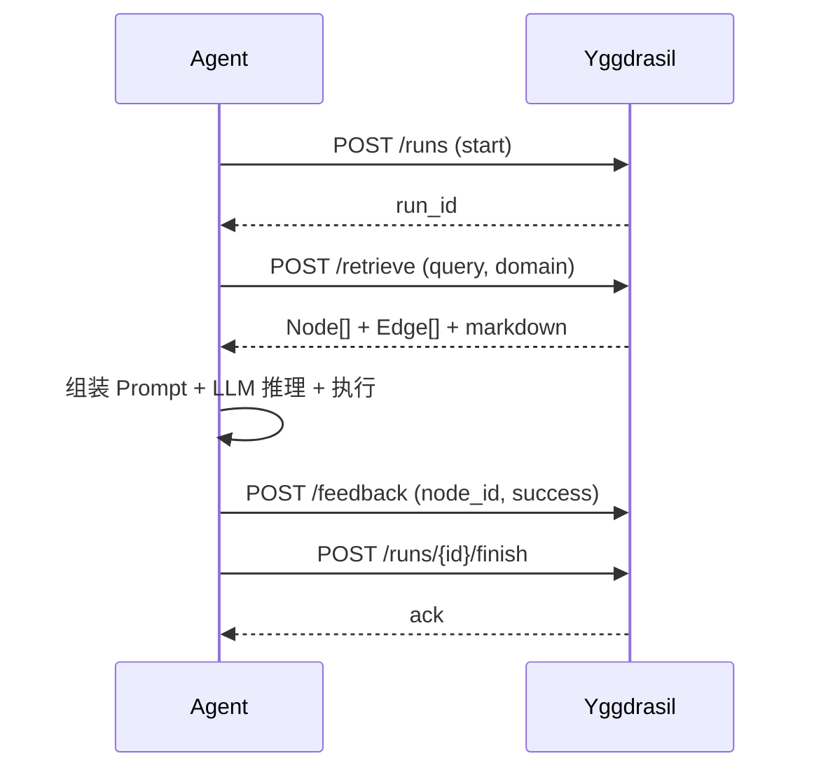

# Yggdrasil Agent 接入指南

> 如何让 Agent 把 Yggdrasil 当作自己的"认知大脑"——从检索到执行、从反馈到演化，完整的接入流程。

## 目录

1. [概述：Yggdrasil 作为 Agent Brain](#1-概述yggdrasil-作为-agent-brain)
2. [核心概念速览](#2-核心概念速览)
3. [最小接入循环](#3-最小接入循环)
4. [Step 0：初始化认知骨架](#4-step-0初始化认知骨架)
5. [Step 1：检索认知上下文](#5-step-1检索认知上下文)
6. [Step 2：组装 Prompt 并发起推理](#6-step-2组装-prompt-并发起推理)
7. [Step 3：记录执行与反馈](#7-step-3记录执行与反馈)
8. [Step 4：Run 全生命周期](#8-step-4run-全生命周期)
9. [Step 5：土壤事件记录](#9-step-5土壤事件记录)
10. [进阶：沙盒探索](#10-进阶沙盒探索)
11. [进阶：年轮与回滚](#11-进阶年轮与回滚)
12. [进阶：多树协作](#12-进阶多树协作)
13. [完整 Agent 接入示例（Python）](#13-完整-agent-接入示例python)
14. [API 速查表](#14-api-速查表)

---

## 1. 概述：Yggdrasil 作为 Agent Brain

普通 Agent 循环：

```
用户输入 → LLM 推理 → 工具调用 → 输出
```

接入 Yggdrasil 后：

```
用户输入 → 检索认知上下文（Skill + Knowledge + Memory）
         → 组装到 Prompt → LLM 推理 → 工具调用
         → 反馈结果（强化/削弱认知节点）
         → 记录 Run 轨迹 → 输出
```

Yggdrasil 做三件事：

1. **检索**阶段——按意图从认知森林中拉取相关的 Skill 定义、领域知识、历史案例
2. **执行**阶段——Agent 基于这些版本化的认知上下文进行推理和行动
3. **反馈**阶段——执行结果回归到认知图谱，驱动强度更新和长期演化

## 2. 核心概念速览

| 概念 | 一句话 | Agent 视角 |
|---|---|---|
| **Domain** | 领域命名空间，如 `database/skills` | 限定检索范围，避免跨领域噪音 |
| **Node（认知原子）** | 一切认知内容的基本单元 | 检索结果就是 Node 列表 |
| **Role** | 节点角色：`capacity`/`schema`/`heuristic`/`case`/`fact`/`state` | 决定 Node 在 Prompt 中的位置和权重 |
| **Edge** | 节点之间的关系：`enables`/`triggers`/`evidences`/... | 图扩展时沿边发现关联知识 |
| **Strength** | 节点/边的可信强度 [0,1] | 排序信号，高强度节点优先返回 |
| **Health** | 节点健康度 [0,1] | 0 = 隔离，不出现在检索结果中 |
| **Tree** | 一个限界上下文的认知集合 | 多领域 Agent 可路由到不同树 |
| **Ring（年轮）** | 不可变认知版本快照 | 每次 Run 绑定特定年轮，保证可复现 |
| **Soil（土壤）** | 不可变事件日志 | 执行结果、观察、反馈写入土壤 |
| **Season（四季）** | 四类演化作业：春生/夏长/秋收/冬藏 | 后台运行，Agent 无需关心 |
| **Sandbox** | 隔离的探索分支 | 高风险尝试在沙盒进行，通过后合并 |

## 3. 最小接入循环

Agent 接入 Yggdrasil 的最小闭环只需三个 API 调用：

```text
POST /api/v1/yggdrasil/retrieve    ← 检索认知上下文
POST /api/v1/yggdrasil/feedback    ← 执行后反馈
POST /api/v1/runs                  ← 开始/结束 Run 记录
```

流程：



## 4. Step 0：初始化认知骨架

Yggdrasil 在首次启动时需要初始化基础骨架——默认领域结构（`database/`, `http/`, `auth/`, `task/`, `utils/` 各含 `skills/`、`knowledge/`、`memories/` 子域）。

这一步由 Engine 自动调用 `ensure_skeleton()`，Agent 无需手动触发。如果你想自定义领域：

```bash
curl -X POST http://localhost:8000/api/v1/yggdrasil/domain \
  -H "Content-Type: application/json" \
  -d '{"domain_name": "security", "parent_path": null}'

# 创建子领域
curl -X POST http://localhost:8000/api/v1/yggdrasil/domain \
  -H "Content-Type: application/json" \
  -d '{"domain_name": "skills", "parent_path": "security"}'
```

## 5. Step 1：检索认知上下文

这是最核心的 API——给定用户意图，返回相关的认知子图。

### 5.1 基本检索

```bash
curl -X POST http://localhost:8000/api/v1/yggdrasil/retrieve \
  -H "Content-Type: application/json" \
  -d '{
    "query": "排查数据库连接超时问题",
    "domain_path": "database",
    "max_nodes": 20
  }'
```

返回结构：

```json
{
  "code": 0,
  "data": {
    "domain": {"id": 5, "full_path": "database"},
    "nodes": [
      {
        "id": "uuid-xxx",
        "role": "capacity",
        "domain_path": "database/skills",
        "title": "查询数据库连接数",
        "content": "SELECT count(*) FROM pg_stat_activity...",
        "strength": 0.85,
        "health": 1.0,
        "season": "summer"
      },
      {
        "id": "uuid-yyy",
        "role": "heuristic",
        "domain_path": "database/knowledge",
        "title": "连接超时排查步骤",
        "content": "1. 检查最大连接数 2. 检查活跃连接 3. 检查锁等待...",
        "strength": 0.72,
        "health": 1.0,
        "season": "autumn"
      }
    ],
    "edges": [
      {
        "id": "edge-xxx",
        "source_id": "uuid-yyy",
        "target_id": "uuid-xxx",
        "relation": "enables",
        "strength": 0.8,
        "evidence_count": 12
      }
    ],
    "total_tokens": 450,
    "markdown": "# 认知上下文\n\n## 可用技能 (Capacity)\n- **查询数据库连接数** (强度=0.85)\n  SELECT count(*) FROM pg_stat_activity..."
  }
}
```

### 5.2 直接获取 Markdown（推荐）

如果只想把上下文原样塞进 Prompt，用 `/retrieve/markdown`：

```bash
curl -X POST http://localhost:8000/api/v1/yggdrasil/retrieve/markdown \
  -H "Content-Type: application/json" \
  -d '{"query": "排查数据库连接超时", "domain_path": "database"}'
```

返回 `Content-Type: text/markdown`，可直接作为用户消息或系统消息的一部分。

### 5.3 检索原理

检索分两步：

1. **向量搜索**（ChromaDB）：用 query embedding 找到 top-20 语义相似节点作为锚点
2. **BFS 图扩展**（DuckDB）：从锚点出发，沿边扩展一跳，发现 `enables`/`triggers`/`evidences` 关联的节点

排序公式：`score = strength × semantic_similarity × season_boost`

- `strength` 高 → 历史验证可靠
- `semantic_similarity` 高 → 与查询相关
- `season_boost`：夏季 ×1.2，春季 ×1.1，秋季 ×1.0，冬季 ×0.9

结果按 role 分组序列化，保证 Skill 定义和知识条目的配额不会互相挤压。

### 5.4 树级检索（v1 API）

如果你在使用新的 Tree/Ring 模型：

```bash
curl -X POST http://localhost:8000/api/v1/trees/{tree_id}/retrieve \
  -H "Content-Type: application/json" \
  -d '{
    "query": "排查数据库连接超时",
    "ring_id": "optional-ring-id",
    "max_nodes": 50
  }'
```

这会走 `RetrievalService`，返回 `VersionedContext`（包含 `NodeRevision` + `EdgeRevision`），节点引用精确到修订版本。

## 6. Step 2：组装 Prompt 并发起推理

检索结果直接以 Markdown 形式提供给 LLM。推荐结构：

```python
system_prompt = """你是一个数据库诊断 Agent。

你的认知库包含以下相关内容。每条知识标注了强度和类型，请据此决定信任程度。
强度 > 0.8 表示经过充分验证；强度 < 0.5 表示仅供参考。

{cognitive_context}"""

user_message = f"用户问题：{user_query}\n\n请基于以上认知上下文进行诊断。"
```

关键约定：

- **优先选择 `capacity` 节点作为可执行 Skill**，调用对应工具
- **`heuristic` 和 `fact` 节点提供推理依据**，标注强度让 LLM 自行判断可信度
- **`case` 节点提供历史参考**，"上次类似问题是这样解决的"
- **`state` 节点提供当前世界状态**，注意检查是否过期

## 7. Step 3：记录执行与反馈

Agent 执行后，将结果反馈给 Yggdrasil。这是认知演化的关键输入。

### 7.1 节点/边反馈

```bash
curl -X POST http://localhost:8000/api/v1/yggdrasil/feedback \
  -H "Content-Type: application/json" \
  -d '{
    "node_id": "uuid-yyy",
    "success": true,
    "step": 0.1
  }'
```

- `success: true` → `strength += step`（上限 1.0）
- `success: false` → `strength -= step`（下限 0.0）
- 可同时传 `node_id` 和 `edge_id`，同时更新

### 7.2 强化关联（strengthen）

当执行路径验证了某条关联关系时：

```python
# 知识 "连接超时排查步骤" 成功使能了 Skill "查询连接数"
await engine.strengthen(
    source_id="uuid-yyy",     # heuristic
    target_id="uuid-xxx",     # capacity
    relation=RelationType.ENABLES,
    step=0.1,
    source_origin=run_id,     # 记录这次 Run 是证据来源
    trace_id=trace_id,
)
```

如果边不存在，`strengthen` 会自动创建（初始强度 0.5 + step）；如果存在，增加强度并更新 `last_activated`。

### 7.3 反馈策略建议

| 场景 | 操作 |
|---|---|
| 检索到的 Skill 被成功执行 | `feedback(node_id, success=True)` |
| 检索到的知识帮助推理正确 | `feedback(node_id, success=True)` |
| 检索到的知识与实际情况冲突 | `feedback(node_id, success=False)` |
| 某条知识触发了一个正确的 Skill | `strengthen(knowledge_id, skill_id, ENABLES)` |
| 某条知识触发了一个失败的 Skill | `feedback(edge_id, success=False)` |

## 8. Step 4：Run 全生命周期

Run 记录是整个认知召回链的中枢——它记录了"在这次任务中，Agent 使用了哪个年轮版本的哪些知识，做了什么决策，结果如何"。

### 8.1 开始 Run

```bash
curl -X POST http://localhost:8000/api/v1/runs \
  -H "Content-Type: application/json" \
  -d '{
    "intent": "排查生产数据库连接超时",
    "tenant_id": "team-db",
    "forest_release_id": "release-24"
  }'
# → {"run_id": "run-xxx", "status": "running", ...}
```

### 8.2 记录引用（中间步骤）

```bash
curl -X POST http://localhost:8000/api/v1/runs/{run_id}/references \
  -H "Content-Type: application/json" \
  -d '{
    "nodes": [{"revision_id": "rev-xxx", "rank": 1, "score": 0.91, "usage_type": "retrieved"}],
    "edges": [{"revision_id": "edge-rev-xxx"}]
  }'
```

接口会幂等写入引用，返回 `{"status":"recorded","nodes":1,"edges":1}`。使用旧版
`/yggdrasil/retrieve` 时可将节点/边的 `id` 作为 `revision_id`；使用 Tree/Ring 检索时应优先
使用响应中的真实 `revision_id`。

### 8.3 记录动作结果

Agent 在自己的执行环境中调用 Skill 后，可以把输入摘要和结果引用挂到 Run：

```bash
curl -X POST http://localhost:8000/api/v1/runs/{run_id}/actions \
  -H "Content-Type: application/json" \
  -d '{
    "skill_revision_id": "skill-rev-xxx",
    "input_payload": {"query": "select 1"},
    "output_ref": "s3://runs/run-xxx/action-1.json",
    "status": "completed"
  }'
```

### 8.4 结束 Run

```bash
curl -X POST http://localhost:8000/api/v1/runs/{run_id}/finish \
  -H "Content-Type: application/json" \
  -d '{"status": "succeeded"}'
```

`status` 取值：`succeeded` / `failed` / `cancelled`。

### 8.5 完整 Run 循环模板

```python
async def agent_loop(user_query: str) -> str:
    # 1. 开始 Run
    run = await start_run(intent=user_query)

    # 2. 检索认知上下文
    context = await retrieve(query=user_query, domain_path="database")

    # 3. 组装 Prompt + LLM 推理 + 执行 Skill
    answer, used_nodes, used_edges = await reason_and_execute(user_query, context)

    # 4. 反馈
    for node in used_nodes:
        await feedback(node_id=node.id, success=node.was_helpful)

    # 5. 结束 Run
    await finish_run(run.run_id, status="succeeded")

    return answer
```

## 9. Step 5：土壤事件记录

除了认知节点反馈，Agent 还应该将**客观观察和动作结果**写入土壤。土壤是追加写的不可变日志，不包含推理结论——那是树的事情。

### 9.1 写入事件

```bash
curl -X POST http://localhost:8000/api/v1/soil/events \
  -H "Content-Type: application/json" \
  -H "Idempotency-Key: run-xxx-step-3" \
  -H "X-Actor-Id: agent-db-diagnoser" \
  -d '{
    "event_type": "action_result",
    "payload": {
      "skill": "查询数据库连接数",
      "query": "SELECT count(*) FROM pg_stat_activity",
      "result": {"count": 142, "max": 200},
      "latency_ms": 820
    },
    "tenant_id": "team-db",
    "source_type": "postgresql",
    "source_ref": "prod-db-01"
  }'
# → {"event_id": "evt-xxx"}
```

### 9.2 事件类型选择

| event_type | 何时使用 | 示例 |
|---|---|---|
| `observation` | 系统直接观测 | 连接延迟 820ms |
| `claim` | 外部主体的陈述 | 用户说"服务恢复了" |
| `evidence` | 可验证材料 | API 返回的 JSON |
| `decision` | Agent 做出的选择 | 选择执行只读诊断 |
| `action_result` | 工具执行结果 | SQL 查询返回 25 行 |
| `evaluation` | 对结果的评价 | 修复建议采纳率 0.91 |

### 9.3 关键约定

- `Idempotency-Key` 头**必须携带**——防止网络重试导致重复写入
- `X-Actor-Id` 头标识操作主体（Agent ID / User ID）
- 土壤是追加写，不覆盖已有事件
- 树干/树枝的内容（Agent 的推理结论）不写入土壤——那是 Run 轨迹的事

## 10. 进阶：沙盒探索

当 Agent 需要执行高风险操作（探索性推理、新 Skill 尝试、自动生成知识），应在沙盒中隔离进行。

### 10.1 Fork 沙盒

```bash
curl -X POST http://localhost:8000/api/v1/sandbox/fork \
  -H "Content-Type: application/json" \
  -d '{"name": "experiment-auto-tune", "created_by": "agent-sql-tuner"}'
# → {"branch_id": "branch-xxx", "name": "experiment-auto-tune", "status": "active"}
```

### 10.2 在沙盒中操作

沙盒 fork 后，Agent 在沙盒中创建节点、建立边、执行操作。所有变更标记为属于该沙盒分支，不影响主干（main branch）。

```python
# Python SDK 视角
sandbox = await engine.fork_sandbox("experiment-auto-tune")
# 在沙盒中创建候选知识
node = await engine.create_node(
    domain_path="database/knowledge",
    role=CognitiveRole.HEURISTIC,
    title="自动发现的连接池优化规则",
    content="当活跃连接 > 80% 最大连接时，建议增加 pool_size",
)
```

### 10.3 评估与合并

```bash
# 评估成功 → merge 回主干
curl -X POST http://localhost:8000/api/v1/sandbox/evaluate \
  -H "Content-Type: application/json" \
  -d '{
    "branch_id": "branch-xxx",
    "success": true,
    "reason": "回放 50 个历史任务，诊断准确率提升 12%"
  }'
# → 沙盒合并，状态变为 archived

# 评估失败 → discard（隔离，保留审计记录）
curl -X POST http://localhost:8000/api/v1/sandbox/evaluate \
  -H "Content-Type: application/json" \
  -d '{
    "branch_id": "branch-xxx",
    "success": false,
    "reason": "新规则导致 3 个回归任务诊断错误"
  }'
# → 沙盒隔离，状态变为 isolated
```

## 11. 进阶：年轮与回滚

### 11.1 为什么 Agent 要关心年轮

年轮（Ring）是认知森林的版本快照。每次 Agent Run 都应该记录使用了哪个年轮——这样当后续发现某条知识有问题时，可以追溯到哪些 Run 受到了影响。

### 11.2 Tree 与 Ring 的关系

```python
# 创建领域树
tree = await tree_service.create_tree(
    name="SQL 诊断",
    bounded_context="database-diagnosis",
)

# 树有 active_ring_id——Agent 检索时默认使用此年轮
# 年轮 sealing 后不可变，新知识通过新年轮发布

# seal → activate 流程（由治理系统执行，Agent 一般不直接调用）
await ring_service.seal(ring_id)      # 封存，不可变
await ring_service.activate(ring_id)  # 切换为 active
```

### 11.3 回滚

当 active 年轮出现污染（错误知识导致大面积误判）：

```bash
curl -X POST http://localhost:8000/api/v1/trees/{tree_id}/rollback \
  -H "Content-Type: application/json" \
  -d '{"target_ring_id": "ring-11"}'
```

回滚后 Agent 的下一次检索自动使用 ring-11，问题年轮保持 sealed 状态用于审计。

## 12. 进阶：多树协作

当 Agent 需要跨领域知识时：

```bash
# 森林路由——找到最相关的树
curl -X POST http://localhost:8000/api/v1/forest/route \
  -H "Content-Type: application/json" \
  -d '{"intent": "排查支付回调延迟导致的安全告警"}'

# 可能返回：security tree + payment tree
# Agent 分别在两棵树中检索，合并上下文
```

多树检索由森林路由决定候选树（通常 1-3 棵），然后在每棵树内独立执行检索，最后合并去重。

## 13. 完整 Agent 接入示例（Python）

```python
"""
Yggdrasil Agent 接入示例
演示完整的 Agent 执行循环：Run → Retrieve → Feedback → Soil
"""
import asyncio
import httpx
import uuid
from typing import List, Dict, Any


class YggdrasilAgent:
    """接入 Yggdrasil 认知引擎的 Agent 基类"""

    def __init__(self, base_url: str = "http://localhost:8000"):
        self.base_url = base_url
        self.client = httpx.AsyncClient(timeout=30.0)

    # ── 辅助方法 ──

    def _idempotency_key(self) -> str:
        return str(uuid.uuid4())

    def _headers(self, actor_id: str = "agent", idempotency_key: str | None = None):
        h = {"X-Actor-Id": actor_id}
        if idempotency_key:
            h["Idempotency-Key"] = idempotency_key
        return h

    # ── 核心循环 ──

    async def run(self, user_query: str, domain: str = "database") -> str:
        """完整的 Agent 执行循环"""

        # 1. 开始 Run
        run = await self._start_run(intent=user_query)
        run_id = run["run_id"]
        print(f"[Run {run_id}] 开始: {user_query}")

        # 2. 检索认知上下文
        ctx = await self._retrieve(query=user_query, domain_path=domain)
        nodes = ctx["nodes"]
        edges = ctx["edges"]
        markdown = ctx["markdown"]
        print(f"[Run {run_id}] 检索到 {len(nodes)} 个节点, {len(edges)} 条边, ~{ctx['total_tokens']} tokens")

        # 记录本次召回的修订引用（网络重试不会重复插入）
        await self._record_references(run_id, nodes, edges)

        # 3. 组装 Prompt（接入你的 LLM 客户端）
        system_prompt = self._build_system_prompt(markdown)
        # answer, used_refs = await your_llm.chat(system_prompt, user_query)

        # 4. 模拟执行结果
        used_nodes = [n for n in nodes if n["role"] == "capacity"]
        answer = "基于认知上下文生成的回答..."

        # 5. 反馈检索到的节点
        for node in used_nodes:
            await self._feedback(
                node_id=node["id"],
                success=True,
                step=0.1,
            )

        # 6. 土壤事件：记录工具调用结果
        for node in used_nodes:
            await self._soil_event(
                event_type="action_result",
                payload={
                    "skill": node["title"],
                    "result": "completed",
                    "latency_ms": 120,
                },
                source_type="skill_executor",
                run_id=run_id,
            )

        # 7. 结束 Run
        await self._finish_run(run_id, status="succeeded")
        print(f"[Run {run_id}] 完成")

        return answer

    def _build_system_prompt(self, cognitive_context: str) -> str:
        return f"""你是数据库诊断 Agent，具备以下认知上下文。

每条知识标注了类型和强度：
- capacity: 你可以调用的 Skill
- heuristic: 经验规则（强度越高越可靠）
- fact: 客观事实
- case: 历史案例
- state: 当前状态（注意有效期）

{cognitive_context}

使用以上知识进行推理和行动。执行后反馈结果，帮助认知引擎进化。"""

    # ── API 调用 ──

    async def _retrieve(self, query: str, domain_path: str | None = None, max_nodes: int = 20) -> dict:
        r = await self.client.post(
            f"{self.base_url}/api/v1/yggdrasil/retrieve",
            json={"query": query, "domain_path": domain_path, "max_nodes": max_nodes},
        )
        return r.json()["data"]

    async def _retrieve_markdown(self, query: str, domain_path: str | None = None) -> str:
        r = await self.client.post(
            f"{self.base_url}/api/v1/yggdrasil/retrieve/markdown",
            json={"query": query, "domain_path": domain_path},
        )
        return r.text

    async def _feedback(self, node_id: str | None = None, edge_id: str | None = None,
                        success: bool = True, step: float = 0.1):
        r = await self.client.post(
            f"{self.base_url}/api/v1/yggdrasil/feedback",
            json={"node_id": node_id, "edge_id": edge_id, "success": success, "step": step},
        )
        return r.json()

    async def _start_run(self, intent: str, tenant_id: str = "default",
                         forest_release_id: str | None = None) -> dict:
        r = await self.client.post(
            f"{self.base_url}/api/v1/runs",
            json={"intent": intent, "tenant_id": tenant_id, "forest_release_id": forest_release_id},
        )
        return r.json()

    async def _finish_run(self, run_id: str, status: str = "succeeded"):
        r = await self.client.post(
            f"{self.base_url}/api/v1/runs/{run_id}/finish",
            json={"status": status},
        )
        return r.json()

    async def _record_references(self, run_id: str, nodes: list[dict], edges: list[dict]):
        r = await self.client.post(
            f"{self.base_url}/api/v1/runs/{run_id}/references",
            json={
                "nodes": [
                    {
                        "revision_id": n.get("revision_id") or n.get("id"),
                        "rank": rank,
                        "score": n.get("score", n.get("strength", 0.0)),
                        "usage_type": "retrieved",
                    }
                    for rank, n in enumerate(nodes, 1)
                    if n.get("revision_id") or n.get("id")
                ],
                "edges": [
                    {"revision_id": e.get("revision_id") or e.get("id")}
                    for e in edges
                    if e.get("revision_id") or e.get("id")
                ],
            },
        )
        return r.json()

    async def _soil_event(self, event_type: str, payload: dict, source_type: str = "",
                          source_ref: str = "", run_id: str = ""):
        key = f"{run_id}-{event_type}-{uuid.uuid4().hex[:8]}"
        r = await self.client.post(
            f"{self.base_url}/api/v1/soil/events",
            json={
                "event_type": event_type,
                "payload": payload,
                "source_type": source_type,
                "source_ref": source_ref,
                "run_id": run_id,
            },
            headers=self._headers(actor_id="agent", idempotency_key=key),
        )
        return r.json()

    async def _create_node(self, domain_path: str, role: str, title: str, content: str = "") -> dict:
        r = await self.client.post(
            f"{self.base_url}/api/v1/yggdrasil/node",
            json={"domain_path": domain_path, "role": role, "title": title, "content": content},
        )
        return r.json()

    async def _add_edge(self, source_id: str, target_id: str, relation: str,
                        strength: float = 0.5, source_origin: str | None = None) -> dict:
        r = await self.client.post(
            f"{self.base_url}/api/v1/yggdrasil/edge",
            json={
                "source_id": source_id, "target_id": target_id,
                "relation": relation, "strength": strength, "source_origin": source_origin,
            },
        )
        return r.json()

    async def close(self):
        await self.client.aclose()


# ── 使用示例 ──

async def main():
    agent = YggdrasilAgent()

    # 查询 1：数据库诊断
    answer = await agent.run("排查数据库连接超时问题", domain="database")
    print(f"Answer: {answer}")

    # 查询 2：只需要 Markdown 上下文（轻量模式）
    ctx = await agent._retrieve_markdown("HTTP 接口限流策略", domain_path="http")
    # 把 ctx 直接传给 LLM...

    await agent.close()

if __name__ == "__main__":
    asyncio.run(main())
```

## 14. API 速查表

### 检索与认知管理（v0 API）

| 方法 | 端点 | 说明 |
|---|---|---|
| POST | `/api/v1/yggdrasil/retrieve` | 混合检索（向量 + 图扩展） |
| POST | `/api/v1/yggdrasil/retrieve/markdown` | 检索并返回 Markdown（直接给 LLM） |
| POST | `/api/v1/yggdrasil/node` | 创建认知节点 |
| GET | `/api/v1/yggdrasil/node/{id}` | 获取节点详情 |
| GET | `/api/v1/yggdrasil/nodes?domain_path=` | 列出领域下节点 |
| POST | `/api/v1/yggdrasil/edge` | 创建边关系 |
| POST | `/api/v1/yggdrasil/feedback` | 节点/边反馈（强度更新） |
| POST | `/api/v1/yggdrasil/domain` | 创建领域 |

### Tree & Ring（v1 API）

| 方法 | 端点 | 说明 |
|---|---|---|
| POST | `/api/v1/trees` | 创建领域树 |
| GET | `/api/v1/trees/{id}` | 获取树详情 |
| POST | `/api/v1/trees/{id}/nodes` | 创建候选认知节点（需 Idempotency-Key） |
| POST | `/api/v1/trees/{id}/retrieve` | 树级混合检索 |
| POST | `/api/v1/rings/{id}/seal` | 封存年轮 |
| POST | `/api/v1/rings/{id}/activate` | 激活年轮 |
| POST | `/api/v1/trees/{id}/rollback` | 回滚到指定年轮 |

### Run 记录

| 方法 | 端点 | 说明 |
|---|---|---|
| POST | `/api/v1/runs` | 开始一次 Agent Run |
| GET | `/api/v1/runs/{id}` | 查询 Run 详情 |
| POST | `/api/v1/runs/{id}/references` | 记录节点/边引用 |
| POST | `/api/v1/runs/{id}/actions` | 记录 Agent 执行 Skill 的输入、结果和状态 |
| POST | `/api/v1/runs/{id}/finish` | 结束 Run（succeeded / failed / cancelled） |

### 土壤事件

| 方法 | 端点 | 说明 |
|---|---|---|
| POST | `/api/v1/soil/events` | 写入事件（需 Idempotency-Key） |
| GET | `/api/v1/soil/events/{id}` | 查询事件 |

### 沙盒

| 方法 | 端点 | 说明 |
|---|---|---|
| POST | `/api/v1/sandbox/fork` | Fork 沙盒分支 |
| POST | `/api/v1/sandbox/evaluate` | 评估沙盒（merge/discard） |
| GET | `/api/v1/sandbox/list` | 列出所有沙盒 |

### 观测（只读）

| 方法 | 端点 | 说明 |
|---|---|---|
| GET | `/api/v1/observe/forest` | 森林全景 |
| GET | `/api/v1/observe/trees/{id}` | 单树详情（canopy + branches + leaves + fruits） |
| GET | `/api/v1/observe/trees/{id}/graph` | 认知图谱（支持 role/status 过滤） |
| GET | `/api/v1/observe/soil/events` | 土壤事件流（支持时间范围、类型过滤） |
| GET | `/api/v1/observe/runs/{id}` | Run 轨迹（steps + references + 评价） |
| GET | `/api/v1/observe/rings/{id}/diff` | 年轮差异比较 |
| GET | `/api/v1/observe/search` | 只读搜索 |

### 关键 HTTP Headers

| Header | 用途 | 何时需要 |
|---|---|---|
| `Idempotency-Key` | 幂等去重 | Soil 写入、Tree node 创建 |
| `X-Actor-Id` | 操作主体标识 | 所有写操作 |

---

## 附录：常见问题

### Q: 新 Agent 接入时没有任何认知节点怎么办？

A: 从种子数据开始。手动创建初始 Skill 和 Knowledge 节点：

```bash
# 1. 创建 Skill 节点
curl -X POST .../api/v1/yggdrasil/node \
  -d '{"domain_path":"database/skills","role":"capacity","title":"查询连接数","content":"SELECT count(*) FROM pg_stat_activity"}'

# 2. 创建 Knowledge 节点
curl -X POST .../api/v1/yggdrasil/node \
  -d '{"domain_path":"database/knowledge","role":"heuristic","title":"连接超时排查","content":"1. 检查最大连接数 2. 检查活跃连接..."}'

# 3. 建立关联
curl -X POST .../api/v1/yggdrasil/edge \
  -d '{"source_id":"<heuristic-id>","target_id":"<skill-id>","relation":"enables"}'
```

之后每次 Agent 执行，反馈会让 `strength` 逐步调整，可靠的知识会自然升高。

### Q: 如何控制上下文 Token 预算？

A: 通过 `max_nodes` 参数。默认 20，建议范围 10-50。检索器内部按 role 分组，确保 Skill 和 Knowledge 不会互相挤占。也可以用 `domain_path` 缩小范围。

### Q: feedback 和 soil event 有什么区别？

A: `feedback` 是**对认知节点的主观评价**——"这条知识对这次任务有用"，直接影响 strength。`soil event` 是**客观事实记录**——"SQL 查询返回了 25 行"，不包含判断。前者是树内演化数据，后者是共同现实的追加日志。

### Q: 年轮太频繁会导致什么？

A: 每个年轮是一次完整的节点/边修订快照。过于频繁（如每小时一次）会导致存储膨胀和发布开销增加。建议按质量或事件阈值触发，不按固定时间。MVP 阶段对 Agent 透明——Agent 只读 active ring，不参与发布决策。
